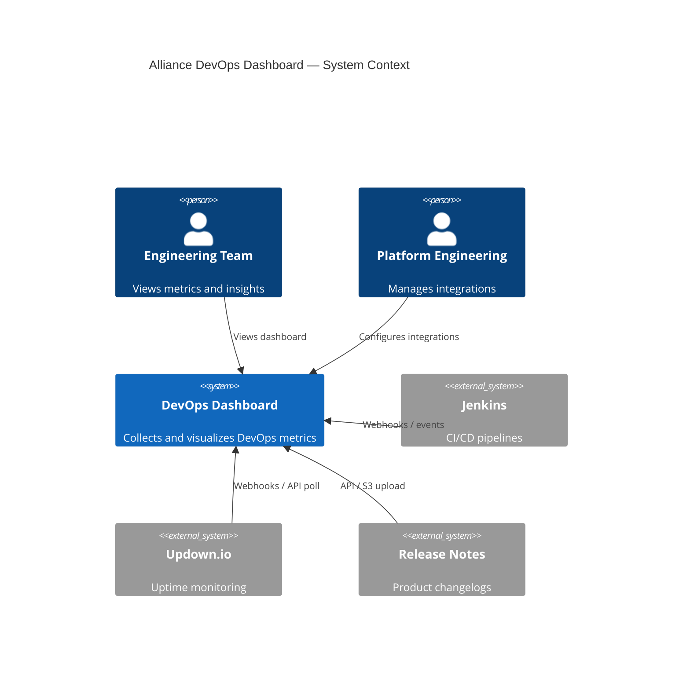
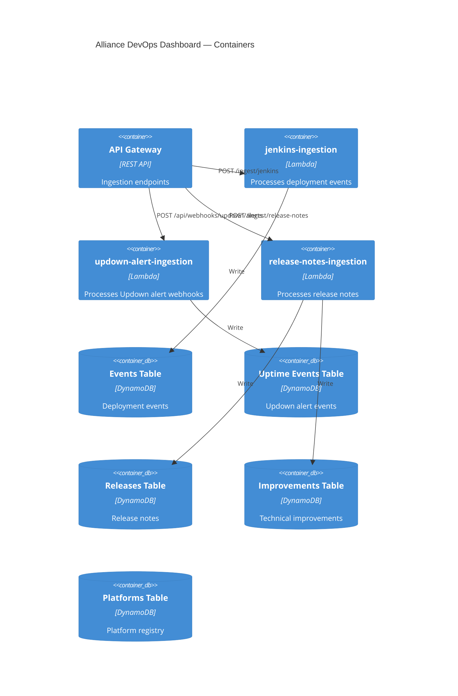

# Architecture

> Alliance DevOps Dashboard — System Architecture Document

## Vision

A centralized, serverless platform for collecting, processing, storing, and visualizing DevOps operational metrics across Alliance digital products.

## Architectural Principles

| # | Principle | Implementation |
|---|-----------|----------------|
| 1 | Spec-Driven Development | `specs/` is the source of truth |
| 2 | Serverless-first | AWS Lambda, API Gateway, DynamoDB |
| 3 | AWS-native | SAM, Secrets Manager, CloudWatch, X-Ray |
| 4 | TypeScript | Strict mode, Node.js 22 |
| 5 | Infrastructure as Code | AWS SAM templates |
| 6 | Modular architecture | Shared libs + independent Lambdas |
| 7 | Clean code | Repository pattern, typed models |
| 8 | Observability by design | Structured logging, tracing, metrics |
| 9 | Extensibility | Placeholder clients, spec extension points |

## System Context



## Container Diagram



## Data Flow

```
External Source → API Gateway → Ingestion Lambda → Validate → Normalize → DynamoDB
                                                                    ↓
                                                          CloudWatch Logs + X-Ray
```

## Module Structure

```
src/
├── lambdas/           # Independent ingestion handlers
│   ├── jenkins-ingestion/
│   ├── updown-alert-ingestion/
│   └── release-notes-ingestion/
└── shared/            # Reusable libraries
    ├── config/        # Environment configuration loader
    ├── logger/        # Structured JSON logging
    ├── models/        # Domain models (aligned with specs)
    ├── services/      # Business logic layer
    ├── repositories/  # DynamoDB abstraction layer
    ├── clients/       # External API clients (placeholders)
    └── utils/         # HTTP helpers, validation
```

## DynamoDB Design

Single-table-inspired pattern with entity type prefixes:

| Entity | PK | SK |
|--------|----|----|
| Platform | `PLATFORM#{id}` | `METADATA` |
| Deployment | `PLATFORM#{platformId}` | `DEPLOYMENT#{timestamp}#{id}` |
| Uptime Event | `PLATFORM#{platformId}` | `UPTIME#{idempotencyKey}` |
| Release | `PLATFORM#{platformId}` | `RELEASE#{date}#{id}` |
| Improvement | `PLATFORM#{platformId}` | `IMPROVEMENT#{createdAt}#{id}` |

GSI1 enables time-range queries by platform and category.

## Security

- IAM least-privilege per Lambda
- Secrets in AWS Secrets Manager (not environment variables for credentials)
- API Gateway throttling and authentication (to be added)
- DynamoDB encryption at rest (AWS managed)
- TLS in transit for all API calls

## Observability

| Signal | Tool | Details |
|--------|------|---------|
| Logs | CloudWatch Logs | Structured JSON via shared logger |
| Traces | AWS X-Ray | Enabled on all Lambdas |
| Metrics | CloudWatch Metrics | Custom ingestion metrics (future) |
| Alarms | CloudWatch Alarms | Failure rate thresholds (future) |

## Deployment

```bash
npm run build
sam build --template-file infrastructure/sam/template.yaml
sam deploy --config-env dev
```

## Future Architecture (Roadmap)

See [roadmap.md](./roadmap.md) for phased delivery plan.

| Phase | Component |
|-------|-----------|
| 2 | Metrics aggregation Lambdas |
| 3 | Dashboard API (read endpoints) |
| 4 | Frontend SPA |
| 5 | Additional integrations (Jira, GitHub, SonarCloud) |

## Related Documents

- [Roadmap](./roadmap.md)
- [Architecture Decisions](./decisions.md)
- [Dashboard Spec](../specs/dashboard/dashboard-overview.md)
- [SAM Template](../infrastructure/sam/template.yaml)
